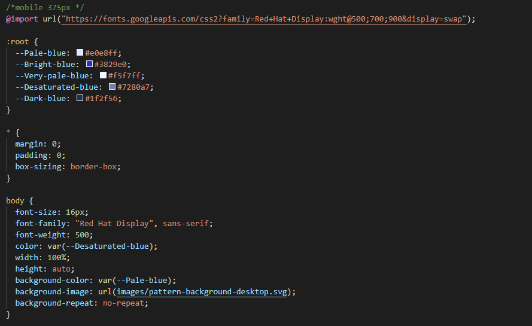
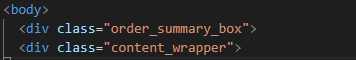
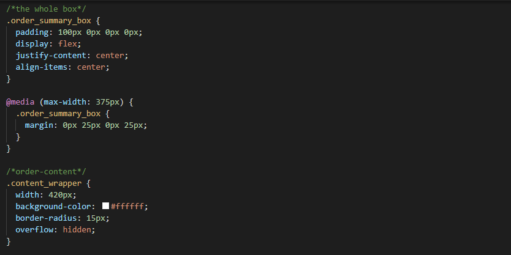

# Frontend Mentor - Order summary card solution

This is a solution to the [Order summary card challenge on Frontend Mentor](https://www.frontendmentor.io/challenges/order-summary-component-QlPmajDUj). Frontend Mentor challenges help you improve your coding skills by building realistic projects.

## Table of contents

- [Overview](#overview)
  - [The challenge](#the-challenge)
  - [Screenshot](#screenshot)
  - [Links](#links)
  - [Built with](#built-with)
  - [What I learned](#what-i-learned)
  - [Continued development](#continued-development)
  - [Useful resources](#useful-resources)
- [Author](#author)
- [Acknowledgments](#acknowledgments)

**Note: Delete this note and update the table of contents based on what sections you keep.**

## Overview

This is the first Frontend Mentor's Challenge that I have decided to try it out and it is a good exercise to test your basic knowledge on your HTML and CSS skills (especially on CSS Flexbox). I timed myself from start to finish this project, which took me approximately 3 hours and 50 minutes to finish from scartch.

### The challenge

in this challenge, users will be able to hover to various links and button and be able to experience some changes.

### Screenshot



I think it is very useful to set up your overall default style in your body tag so that it saved you alot of time and not having you to write down every CSS text in every class.



In this screenshot, I wrapped all my order-summary content a div within a div so that I can easily position the box into the middle of the page and also applying the content wrapper for the whole order-summary content.

I also include another screenshot to show you how I managed to easily centered the box with the usage of CSS flexbox and justify content and align item.



### Links

- Solution URL: (https://github.com/EwenYiWen/order-summary)
- Live Site URL: (https://ewenyiwen.github.io/order-summary/)

### Built with

This challenge is a good start for beginners who just finished learning HTML and CSS and wish to polish back their skillset.

- Semantic HTML5 markup
- CSS custom properties
- Flexbox

### What I learned

As mentioned earlier, I am very happy that I finally understood how CSS flexbox is so useful to centering content in a page. Furthermore, I am have also learned that we can apply overflow: hidden as a way to crop our picture if it is too big for the content in oder to make it fit in the container.

```css
.order_summary_box {
  display: flex;
  justify-content: center;
  align-items: center;
}

body {
  overflow: hidden;
}
```

### Continued development

I wished that I will be able to polish my CSS grid skills with the upcoming challenges that I am about to try it out soon in the future.

### Useful resources

- [resource 1](https://www.educative.io/edpresso/how-to-crop-an-image-in-css) - This websited helped me to apply overflow properties correctly so that I am able to crop the picture according to the design.

- [resource 2](https://www.w3schools.com/cssref/css3_pr_box-shadow.asp) - WW3 helped me in terms of understanding how CSS box shadow properties works and it helped me successfully apply the shadow according to the design.

## Author

- Frontend Mentor - [@EwenYiWen](https://www.frontendmentor.io/profile/EwenYiWene)

## Acknowledgments

I really grateful that WW3 school's content because it helped me through a lot of times when i was stucked with some coding skills. I really recommend anyone who stucked go check WW3 school a go and check their content out and also I am grateful that Frontend Mentor's Challenge to make all this happened. :D.
